# Full-Stack App

This is a full-stack application with `frontend` and `backend` folders.

## 🛠 How to Start the App

```bash
# 1 add .env file in /backend and /frontend

# 2. Make sure Docker is running
start database => docker compose up

# 3. Start the backend
cd ./backend
yarn install
yarn dev


#4. Start webhook stripe
cd ./backend 
yarn start-stripe
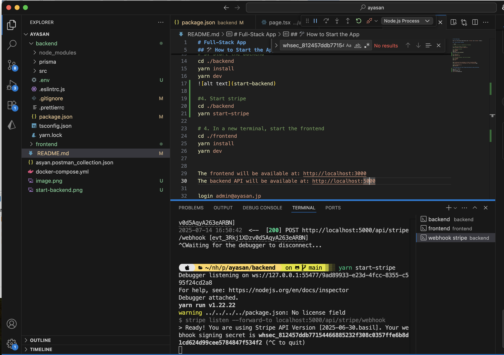

# 4. In a new terminal, start the frontend
cd ./frontend
yarn install
yarn dev
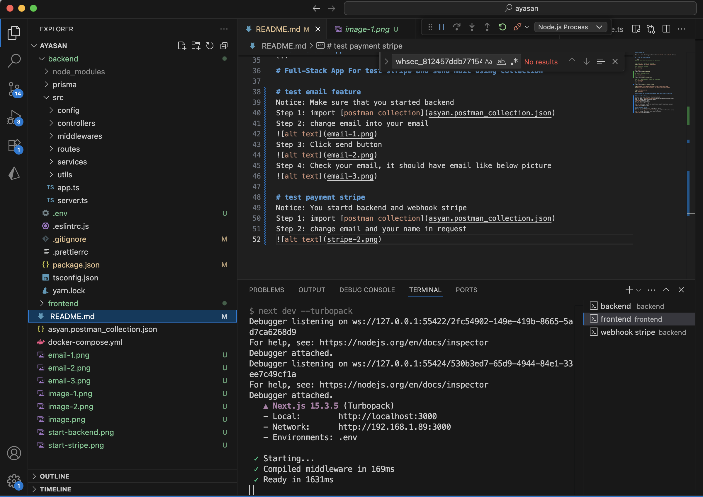

The frontend will be available at: http://localhost:3000
The backend API will be available at: http://localhost:5000

login admin@ayasan.jp
pass admin123
```
# Full-Stack App For test stripe and send mail using collection

# Test Email Feature
Notice: Make sure that you started backend </br>
**Step 1**: import [postman collection](asyan.postman_collection.json) </br>
**Step 2**: change email into your email 
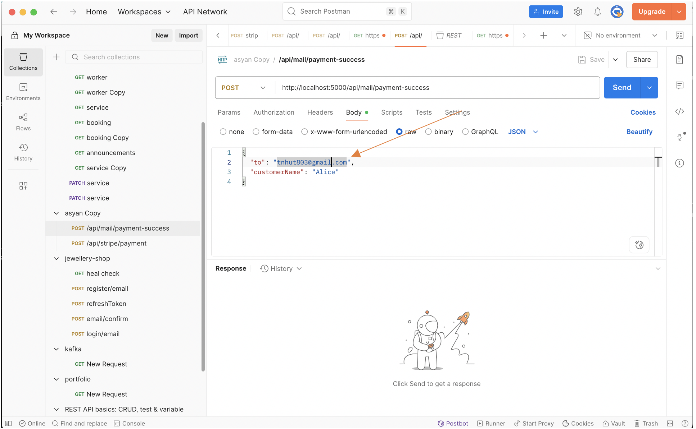
**Step 3**: Click send button </br>
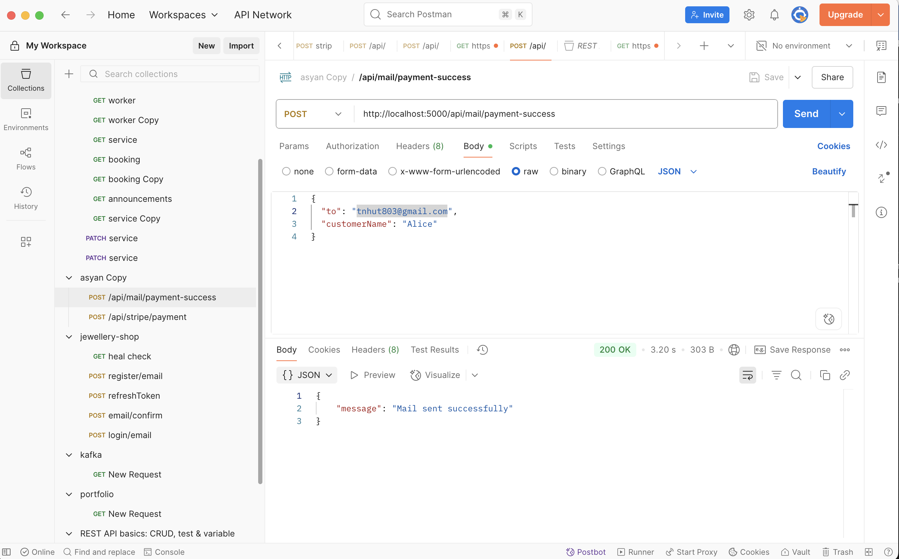
**Step 4**: Check your email, it should have email like below picture </br>
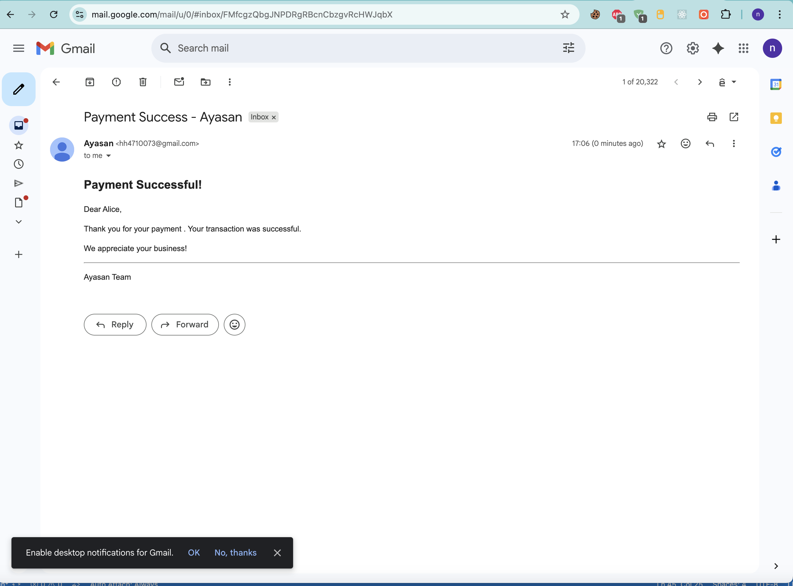

# Test Stripe Payment 
Notice: You startd backend and webhook stripe </br>
**Step 1**: import [postman collection](asyan.postman_collection.json) </br>
**Step 2**: change email and your name in request </br>
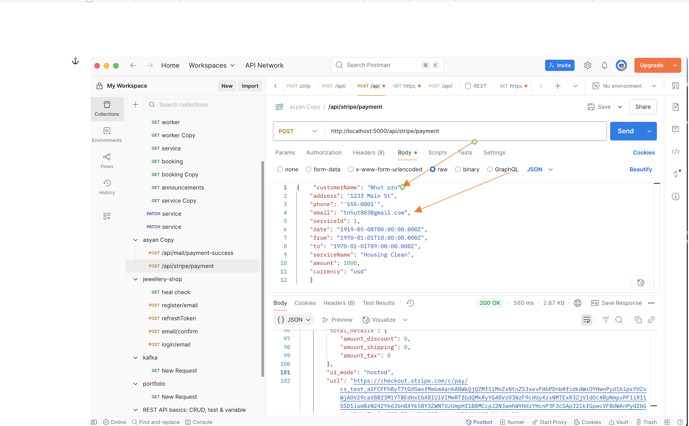
**Step 3**: Click Send Button </br>
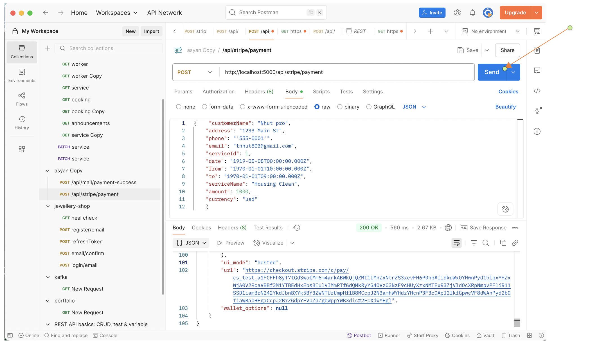
**Step 4**: Open new browser tab with value of url </br>
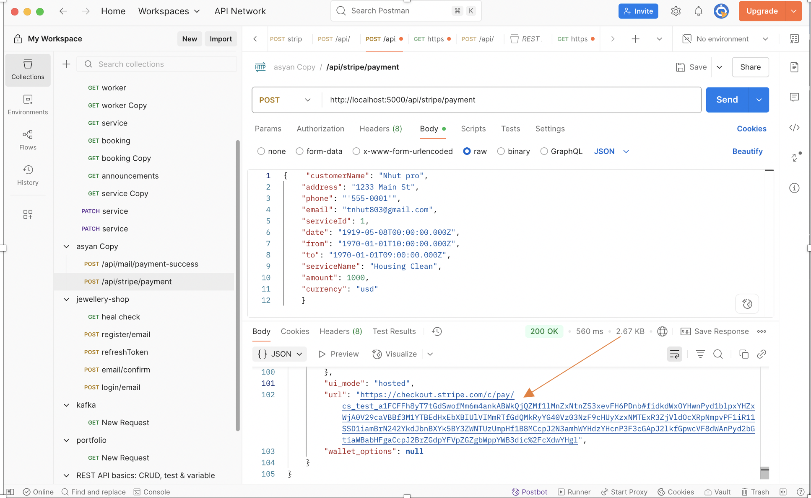
**Step 5**: type your payment info </br>
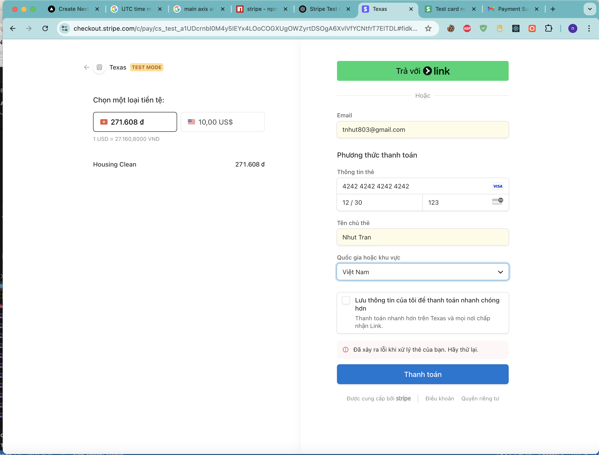 
**Step 6**: Check result </br>
- browser show success page </br>
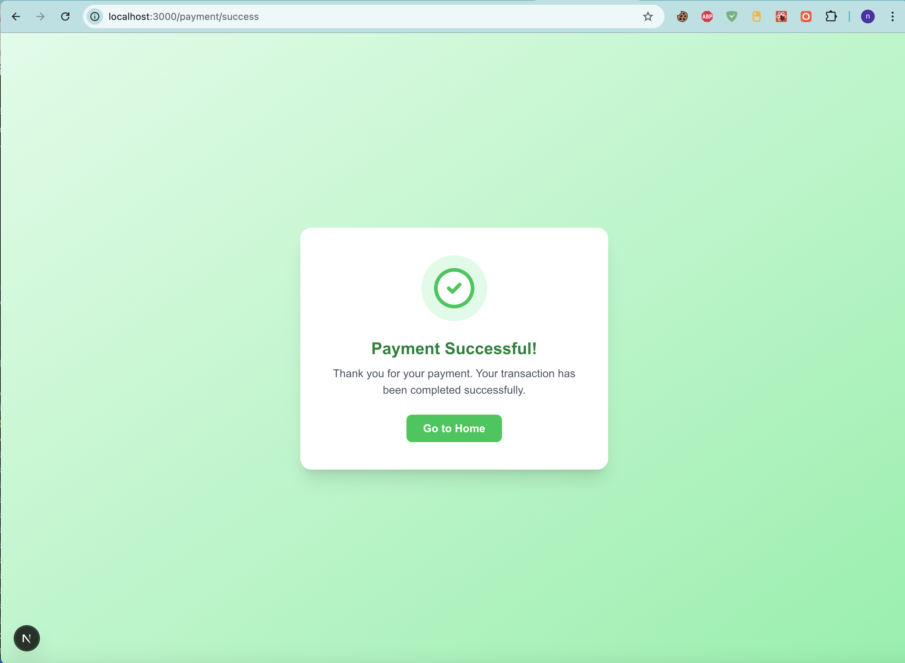
- Receive email </br>
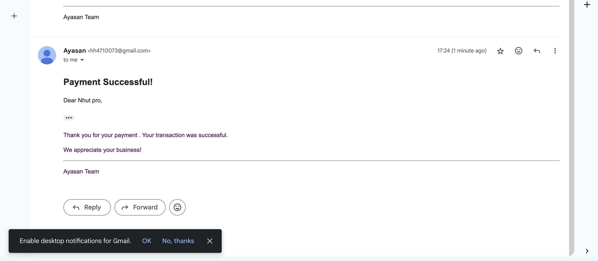
- Have new record for booking </br>
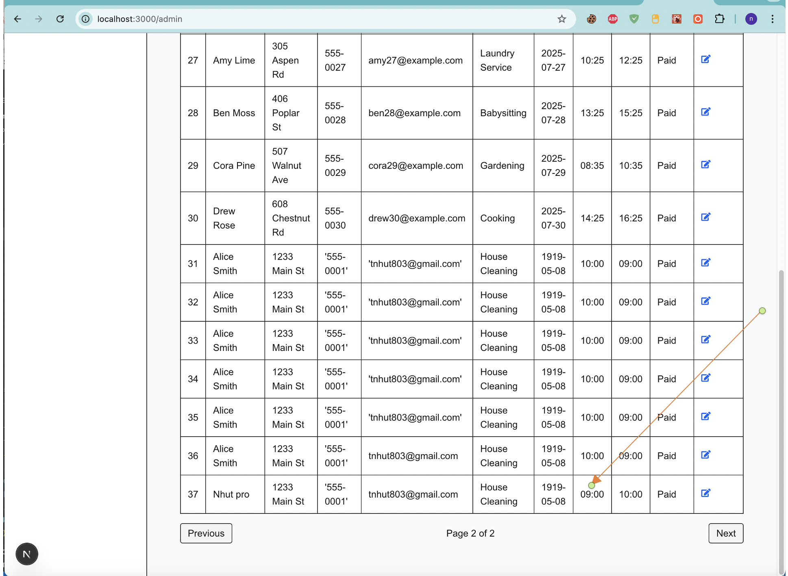

